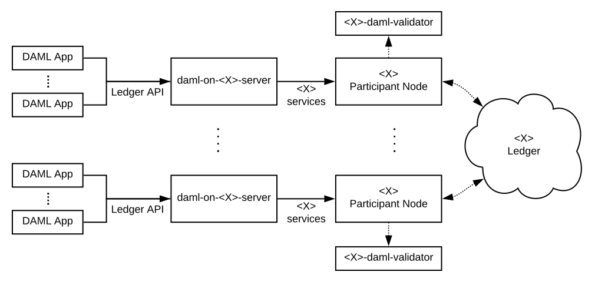
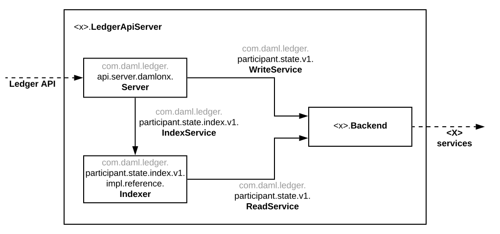

.. _integration-kit:

DAML Integration Kit
####################

The DAML Integration Kit allows third-party ledger developers to
implement a DAML Ledger on top of their distributed-ledger or database of
choice. How does that work?

A DAML Ledger implementation is a server serving the
:doc:`/app-dev/ledger-api-introduction/index` as per the semantics defined in
the :doc:`/concepts/ledger-model/index` and the
`DAML-LF specification <https://github.com/digital-asset/daml/blob/master/daml-lf/spec/daml-lf-1.rst>`_.
Theoretically, you could
implement such a server from scratch following the above documentation.
Practically, we though strongly recommend to use our integration kit and follow
the guides below for
:ref:`implementing <integration-kit_implementing>`,
:ref:`deploying <integration-kit_deploying>`,
:ref:`testing <integration-kit_testing>`, and
:ref:`benchmarking <integration-kit_benchmarking>` your own DAML Ledger
server. This way you can focus on your distributed-ledger or database of
choice and reuse our DAML Ledger server and DAML interpreter code for
implementing the DAML Ledger API.

Status and Roadmap
******************

Documentation

- explain versioning
- explain validation
- reference example project
- reporting issues
- scaladocs

Contents

- What is the DLIK?
- What is its current state?
- How is the DLIK going to evolve?
- What DAML-on-X ledgers are there?

.. _integration-kit_implementing:

Implementing your own DAML Ledger
*********************************

Architectural Overview
======================

We explain how to implement a DAML ledger backed by a specific
ledger `X`. This can be a proper distributed ledger or also just a database.
The goal of this implementation is to allow multiple DAML applications, which are potentially run by
different entities, to execute multi-party workflows using the ledger `X`. We
illustrate this in the following diagram.

.. original: https://www.lucidchart.com/invitations/accept/69799877-4e80-444d-96a3-3e90814e94df

We assume that the `X` ledger allows entities to participate in the
evolution of the ledger via particular nodes. In the remainder of this
documentation, we call these nodes `participant nodes`.

The boxes labelled `daml-on-<X>-server` denote the DAML Ledger API
servers, which implement the DAML Ledger API on top of the services provided
by the `X` participant nodes.

The boxes labelled `<X>-daml-validator` denote `X`-specific DAML transaction
validation services. In a distributed ledger they provide the ability for
nodes to :doc:`validate DAML transactions </concepts/ledger-model/ledger-integrity>`
at the appropriate stage in the `X` ledger's transaction commit process.
Whether they are needed, by what nodes they are used, and whether they are run
in-process or out-of-process depends on the `X` ledger's architecture. Above
we depict a common case where the participant nodes jointly maintain the
ledger's integrity and therefore need to validate DAML transactions.

Message Flow
------------

**TODO: explain how a transaction gets committed against an abstract ledger**

Implementing your server and validator
======================================

Each `X` ledger requires at least the implementation of a specific
`daml-on-<X>-server`. It might also require the implementation of a
`<X>-daml-validator` as explained above. We provide two kinds of code to
simplify their implementation.

1. We provide Scala libraries for validating DAML transactions and serving the
   Ledger API given implementations of two specific interfaces. See
   :ref:`below <integration-kit_library_overview>` for an overview of these
   libraries.

2. We provide the `digital-asset/daml-on-x-example <https://github.com/digital-asset/daml-on-x-example>`_ GitHub repository,
   which contains a complete example of a DAML Ledger backed by an in-memory
   key-value store. It builds on our Scala libraries and demonstrates how they
   can be assembled to serve the Ledger API and validate DAML transactions.

   For ledgers where data is shared between all participant nodes, we
   recommend using this example as a starting point for implementing your
   server and validator. For ledgers with stronger privacy models, this example
   can serve as an inspiration. You will need to dive deeper into how
   transactions are represented and how to communicate them to
   implement :doc:`DAML's privacy model </concepts/ledger-model/ledger-privacy>`
   at the ledger level instead of just at the Ledger API level.

Getting Started
---------------

Implementing your own server and validator requires three things: learning the
necessary context, deciding on an architecture, and writing their code.

There is a lot of context required for this implementation task. We recommend
the following steps to gain this context.

1. Complete the :doc:`/getting-started/quickstart`.
2. Get an in-depth understanding of the :doc:`/concepts/ledger-model/index`.
3. Build a mental model of how the :doc:`/app-dev/ledger-api-introduction/index`
   is used to build DAML Applications.

.. _integration-kit_writing_code:

Writing the Code
----------------

Once you've completed the above steps, we recommend following these steps to
implement your own server and validator.

1. Clone our example DAML Ledger backed by an in-memory key-value store from
   the `digital-asset/daml-on-x-example <https://github.com/digital-asset/daml-on-x-example>`_.

   **TODO: create this example repository**

2. Read the example code jointly with the :ref:`integration-kit_library_overview`
   given below.
3. Combine all the knowledge gained to decide on the architecture for your
   DAML on `X` ledger.
4. Implement your architecture; and let the world know about it.

Use the feedback form on this documentation page or GitHub issues on the
`digital-asset/daml <https://github.com/digital-asset/daml>`_ repository to
get into contact with us. Questions and feedback welcome!

.. _integration-kit_library_overview:

Library Infrastructure Overview
-------------------------------

We provide the following four Scala libraries to help you implement your
server and validator. As explained in :ref:`integration-kit_writing_code`,
this guide is best read jointly with the code of our `example ledger
<https://github.com/digital-asset/daml-on-x-example>`_.

``participant-state.jar`` (`source code <https://github.com/digital-asset/daml/blob/master/ledger/participant-state/src/main/scala/com/daml/ledger/participant/state/v1/package.scala>`_)
  contains interfaces abstracting over the state of
  a participant node relevant for a DAML Ledger API server. These are the
  interfaces whose implemention is specific to a particular `X` ledger. These
  interfaces are optimized for ease of implementation.
``participant-state-index.jar`` (`source code <https://github.com/digital-asset/daml/tree/master/ledger/participant-state-index>`_)
  contains code for reading the abstract state
  of a participant node and indexing it to satisfy the read access
  patterns required for serving the Ledger API. The library provides both
  an interface enumerating all read access methods and an in-memory
  reference implementation of that interface.
  We expect to provide a persistent, SQL-backed index in the future
  (tracked in this `GitHub issue <https://github.com/digital-asset/daml/issues/581>`_).
``api-server-damlonx.jar`` (`source code <https://github.com/digital-asset/daml/blob/master/ledger/api-server-damlonx/src/main/scala/com/daml/ledger/api/server/damlonx/Server.scala>`_)
  contains code that implements a DAML Ledger API
  server given implementations of the interfaces in ``participant-state.jar``.
``daml-engine.jar`` (`source code <https://github.com/digital-asset/daml/blob/master/daml-lf/engine/src/main/scala/com/digitalasset/daml/lf/engine/Engine.scala>`_)
  contains code for serializing and deserializing DAML
  transactions and for validating them. An `<X>-daml-validator` is typically
  implemented by wrapping this code in the `X`-ledger's SDK for building
  transaction validators.

The following diagram shows how the classes and interfaces provided by these
libraries are typically combined to instantiate a DAML Ledger API server
backed by an `X` ledger.

.. original: https://www.lucidchart.com/invitations/accept/04239d8e-70ec-4734-b943-9780731fa704

The diagram uses boxes labelled with fully qualified class names to denote class instances.
It uses solid arrows labelled with fully qualified interface names to denote that an instance
depends on another instance providing that interface. It uses dashed arrows to
denote that a class instance depends on or provides particular services. It
uses boxes embedded in other boxes to denote that the outer class instance
creates the contained instances.

We explain the elements of the diagram in turn. For brevity, we drop prefixes
of their qualified names where unambiguous.

:doc:`/app-dev/ledger-api-introduction/index`
  is the collection of gRPC
  services that you would like your `daml-on-<X>-server` to provide.
``<X> services``
  are the services provided by our underlying ledger,
  which you aim to leverage to build your `daml-on-<X>-server`.
``<x>.LedgerApiServer``
  is the class whose main method or constructor
  creates the contained instances and wires them up to provide the Ledger API
  backed by the ``<X> services``. You need to implement this for your DAML on
  `X` ledger.
``WriteService`` (`source code <https://github.com/digital-asset/daml/blob/master/ledger/participant-state/src/main/scala/com/daml/ledger/participant/state/v1/WriteService.scala>`_)
  is an interface abstracting over the ability to submit
  DAML transactions to the underlying `X` ledger via a participant node.
``ReadService`` (`source code <https://github.com/digital-asset/daml/blob/master/ledger/participant-state/src/main/scala/com/daml/ledger/participant/state/v1/ReadService.scala>`_)
  is an interface abstracting over the ability to subscribe to
  changes of the `X` ledger visible to a particular participant node.
``<x>.Backend``
  is a class implementing the ``ReadService`` and the
  ``WriteService`` on top of the ``<X> services``. You need to implement this
  for your DAML on `X` ledger.
``IndexService`` (`source code <https://github.com/digital-asset/daml/blob/master/ledger/participant-state-index/src/main/scala/com/daml/ledger/participant/state/index/v1/IndexService.scala>`_)
  is an interface specific to the needs
  that the ``damlonx.Server`` class has for querying the participant state
  exposed by the ``ReadService``.
  It contains methods for all the different read access patterns the
  ``Server`` uses to serve the Ledger API. We include it in this diagram, as
  in the future there will be choice on what implemention of the
  ``IndexService`` to choose.
``index.v1.impl.reference.Indexer`` (`source code <https://github.com/digital-asset/daml/blob/master/ledger/participant-state-index/reference/src/main/scala/com/daml/ledger/participant/state/index/v1/impl/reference/ReferenceIndexService.scala>`_)
  is an in-memory implementation of
  the ``IndexService`` interface. We recommend using that until the SQL-based
  index service is ready. See this `GitHub issue
  <https://github.com/digital-asset/daml/issues/581>`_ for its status.
``damlonx.Server`` (`source code <https://github.com/digital-asset/daml/blob/master/ledger/api-server-damlonx/src/main/scala/com/daml/ledger/api/server/damlonx/Server.scala>`_)
  is a class containing all the code to implement the
  Ledger API on top of an ``IndexService`` and a ``WriteService``. Its
  constructor also takes additional arguments for configuring among others
  logging and the port at which the Ledger API is served.

.. _integration-kit_deploying:

Deploying a DAML Ledger
***********************

.. _integration-kit_testing:

Testing a DAML Ledger
*********************

.. _integration-kit_benchmarking:

Benchmarking a DAML Ledger
**************************

