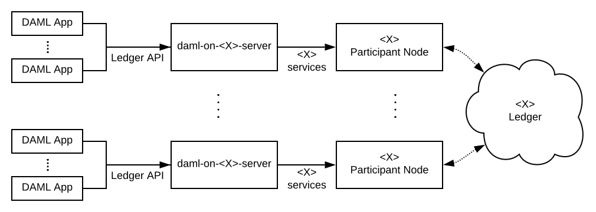
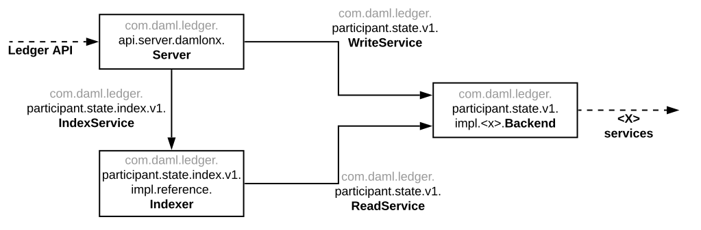

.. _ledger-integration-kit:

DAML Ledger Integration Kit
###########################

The DAML Ledger Integration Kit allows third-party ledger developers to
implement a DAML Ledger on top of their distributed-ledger or database of
choice. How does that work?

A DAML Ledger implementation is a server serving the
:doc:`/app-dev/ledger-api-introduction/index` as per the semantics defined in
the :doc:`/concepts/ledger-model/index` and the
`DAML-LF specification <https://github.com/digital-asset/daml/blob/master/daml-lf/spec/daml-lf-1.rst>`_.
Theoretically, you could
implement such a server from scratch following the above documentation.
Practically, we though strongly recommend to use our integration kit and follow
the guides below for
:ref:`implementing <ledger-integration-kit_implementing>`,
:ref:`deploying <ledger-integration-kit_deploying>`,
:ref:`testing <ledger-integration-kit_testing>`, and
:ref:`benchmarking <ledger-integration-kit_benchmarking>` your own DAML Ledger
server. This way you can focus on your distributed-ledger or database of
choice and reuse our DAML Ledger server and DAML interpreter code for
implementing the DAML Ledger API.

Status and Roadmap
******************

TODO

.. _ledger-integration-kit_implementing:

Implementing your own DAML Ledger
*********************************

Architectural Overview
======================

We explain how to implement a DAML ledger backed by a specific
ledger `X`, which could be a proper distributed ledger or also just a database.
The goal of this implementation is to allow multiple DAML applications, which are potentially run by
different entities, to execute multi-party workflows using the ledger `X`. We
illustrate this in the following diagram.

We assume that the `X` ledger allows parties to participate in the
evolution of the ledger via particular nodes. In the remainder of this
documentation, we call these nodes `participant nodes`.
The box labelled `daml-on-<X>-server` denotes the DAML Ledger API
server, which implements the DAML Ledger API on top of the services provided
by the `X` participant nodes.

Infrastructure Overview
=======================

Each `X` ledger requires the implementation of a specific
`daml-on-<X>-server`.  We provide three Scala libraries to for this
implementation task:

- ``participant-state.jar`` (`source code <https://github.com/digital-asset/daml/tree/master/ledger/participant-state>`_) contains interfaces abstracting over the state of
  a participant node relevant for a DAML Ledger API server. These are the
  interfaces whose implemention is specific to a particular `X` ledger. These
  interfaces are optimized for ease of implementation.
- ``participant-state-index.jar`` contains code for reading the abstract state
  of a participant node and indexing it to satisfy the read access
  patterns required for serving the Ledger API. The library provides both
  an interface enumerating all read access methods and an in-memory
  reference implementation of that interface.
  We expect to provide a persistent, SQL-backed index in the future
  (tracked in this `Github issue <https://github.com/digital-asset/daml/issues/581>`_).
- ``api-server-damlonx.jar`` contains code that implements a DAML Ledger API
  server given implementations of the interfaces in ``participant-state.jar``.

**TODO: explain how to access these libraries.**

The following diagram shows how the classes and interfaces provided by these
libraries are typically combined to instantiate a DAML Ledger API server
backed by a distributed ledger (or database) `X`.

The diagram uses boxes labelled with fully qualified class names to denote class instances.
It uses solid arrows labelled with fully qualified interface names to denote that an instance
depends on another instance providing that interface. It uses dashed arrows to
denote that a class instance depends on or provides particular services.

We explain the elements of the diagram in turn. For brevity, we refer to them
by their unqualified names, which are typeset in bold.

- The :doc:`/app-dev/ledger-api-introduction/index` is the collection of gRPC
  services that we would like our `daml-on-<X>-server` to provide.
- The ``<X> services`` are the services provided by our underlying ledger,
  which we aim to leverage to build our `daml-on-<X>-server`.
- The ``WriteService`` interface abstracts over the ability to submit
  DAML transactions to the underlying ledger.
- The ``ReadService``

- The ``Backend`` class

  which we aim to use here to build a fully functional
  , which provides a number of ``<X> services`` for
  configuration, synchronization, and persistence.

The ``server.damlonx.Server`` instance serves the Ledger API using the
provided handles to an instance of the `

Setting up your project
=======================

TODO: copy from Java Bindings Maven setup

Writing the code
================

TODO:

.. _ledger-integration-kit_deploying:

Deploying a DAML Ledger
***********************

.. _ledger-integration-kit_testing:

Testing a DAML Ledger
*********************

.. _ledger-integration-kit_benchmarking:

Benchmarking a DAML Ledger
**************************

* What is the DLIK?
* What is its current state?
* How is the DLIK going to evolve?
* What DAML-on-X ledgers are there?
